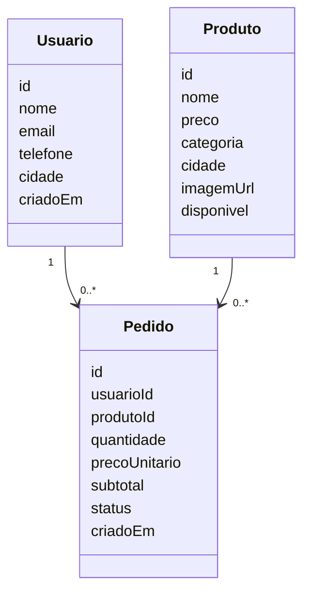
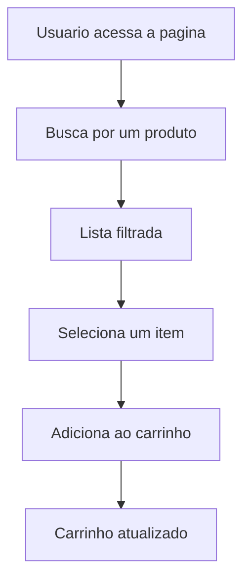

# MarketIA

MarketIA e um exercicio de marketplace/e-commerce minimalista. O objetivo do projeto e representar, de forma simples, a ideia de uma tela inicial com produtos, busca, categorias, usuario simulado e carrinho.

O projeto nao tem backend implementado. Foi gerado um arquivo `index.html` para materializar visualmente a proposta descrita nos documentos Markdown.

## O que existe no projeto

- `index.html`: prototipo navegavel em HTML, CSS e JavaScript puro. Ele apresenta uma listagem fixa de 12 produtos, filtro por categoria, busca por texto, login/logout simulado e carrinho com persistencia em `localStorage`.
- `images/`: imagens usadas nos cards dos produtos.
- `docs/ADR.md`: registro de decisao arquitetural. O documento explica a escolha sugerida para uma evolucao do projeto como monolito modular usando Node.js, TypeScript, Fastify, SQLite, Prisma, Zod e Vitest.
- `docs/diagrama.md`: contem diagramas em Mermaid para representar uma ideia inicial de entidades e fluxo de uso.
- `LICENSE`: arquivo de licenca do projeto.

## Como visualizar

Abra o arquivo `index.html` diretamente no navegador.

```text
index.html
```

Como o projeto foi feito apenas como exercicio, nao e necessario instalar dependencias nem iniciar um servidor local.

## Diagramas

Os diagramas abaixo foram escritos em Mermaid e tambem estao disponiveis em `docs/diagrama.md`.

### Modelo conceitual



### Fluxo de uso



## Observacao

Este repositorio representa uma ideia inicial. O `ADR.md` descreve uma possivel arquitetura futura, enquanto o `index.html` demonstra a experiencia proposta de forma estatica e interativa no navegador.
