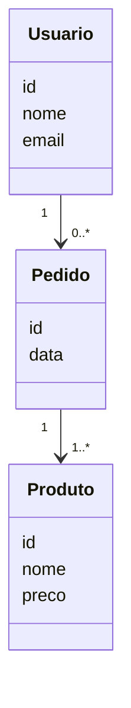
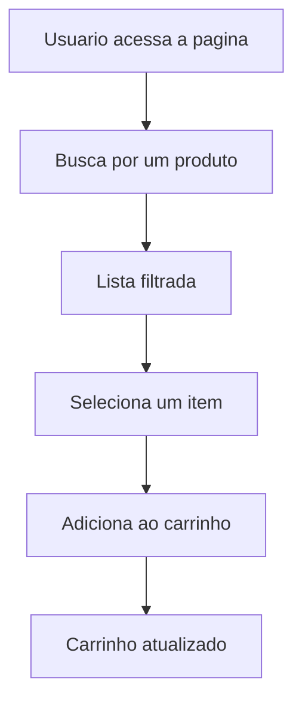

# Diagramas

```mermaid
classDiagram
    class Usuario {
        id
        nome
        email
    }

    class Produto {
        id
        nome
        preco
    }

    class Pedido {
        id
        data
    }

    Usuario "1" --> "0..*" Pedido
    Pedido "1" --> "1..*" Produto
```

```mermaid
flowchart TD
    A[Usuario acessa a pagina] --> B[Busca por um produto]
    B --> C[Lista filtrada]
    C --> D[Seleciona um item]
    D --> E[Adiciona ao carrinho]
    E --> F[Carrinho atualizado]
```
