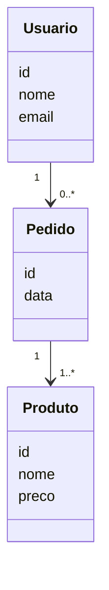

# Diagrama UML

```mermaid
classDiagram
    class Usuario {
        id
        nome
        email
    }

    class Produto {
        id
        nome
        preco
    }

    class Pedido {
        id
        data
    }

    Usuario "1" --> "0..*" Pedido
    Pedido "1" --> "1..*" Produto
```
