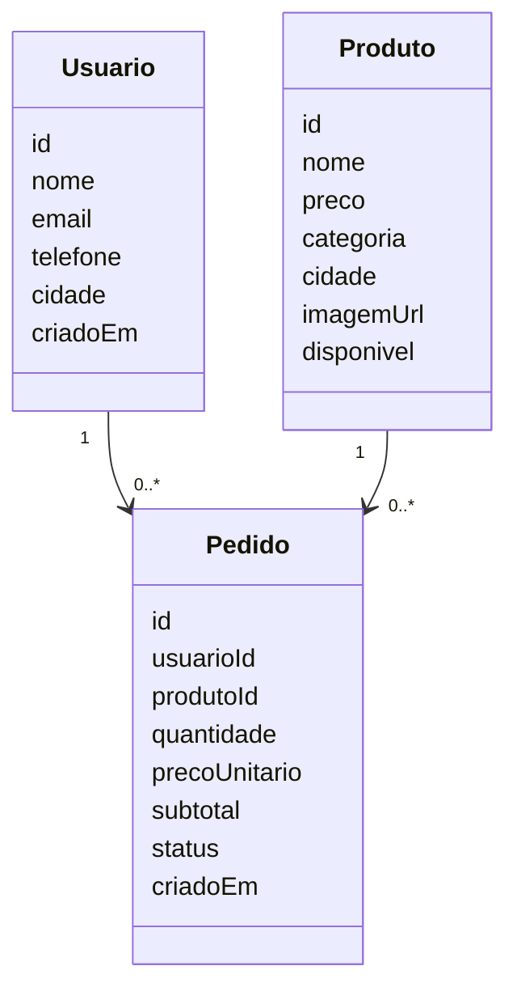
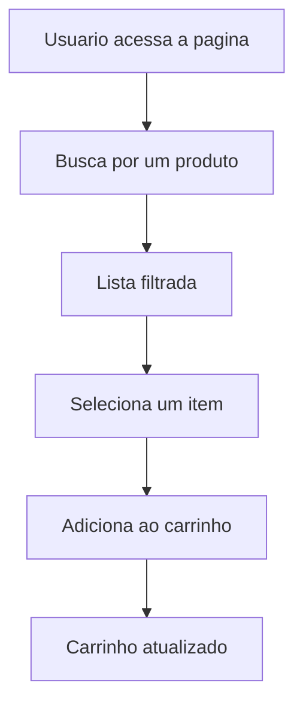

# Diagramas

```mermaid
classDiagram
    class Usuario {
        id
        nome
        email
        telefone
        cidade
        criadoEm
    }

    class Produto {
        id
        nome
        preco
        categoria
        cidade
        imagemUrl
        disponivel
    }

    class Pedido {
        id
        usuarioId
        produtoId
        quantidade
        precoUnitario
        subtotal
        status
        criadoEm
    }

    Usuario "1" --> "0..*" Pedido
    Produto "1" --> "0..*" Pedido
```

```mermaid
flowchart TD
    A[Usuario acessa a pagina] --> B[Busca por um produto]
    B --> C[Lista filtrada]
    C --> D[Seleciona um item]
    D --> E[Adiciona ao carrinho]
    E --> F[Carrinho atualizado]
```
